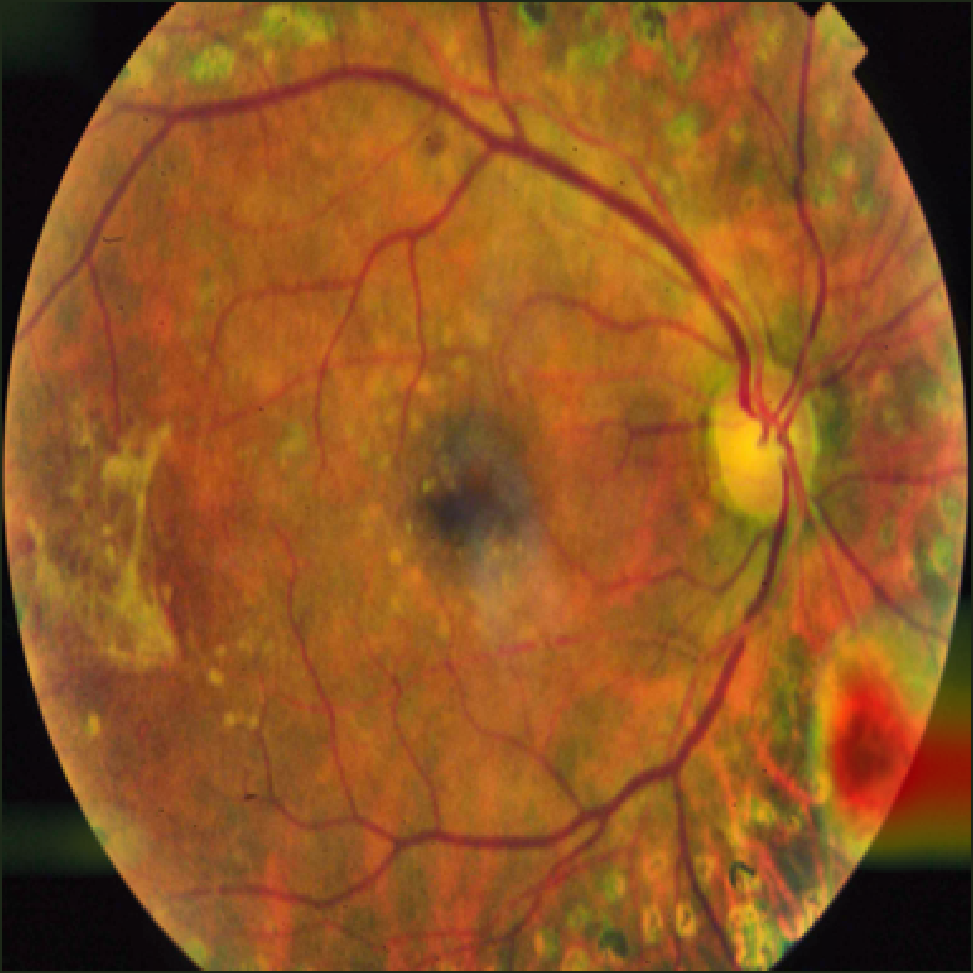
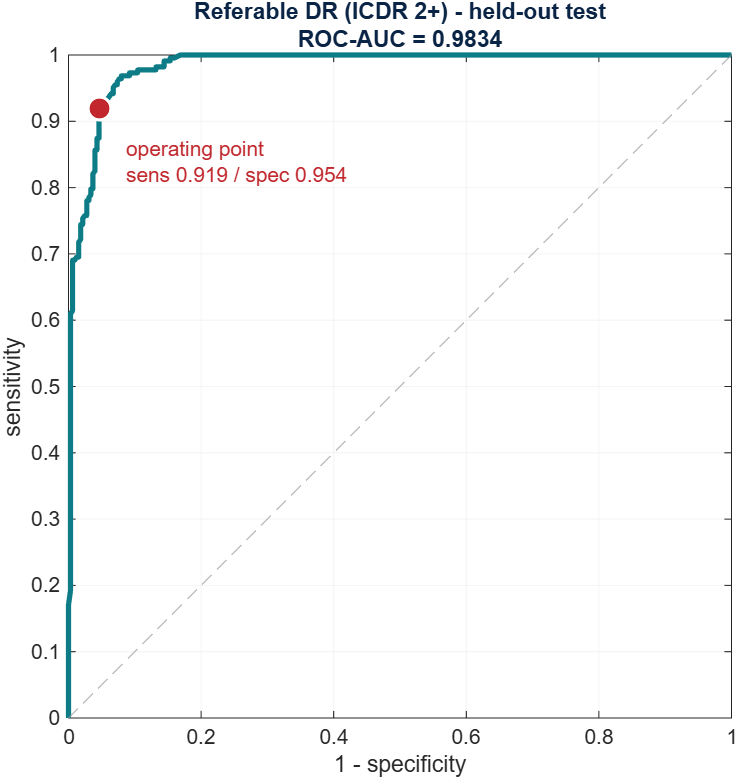
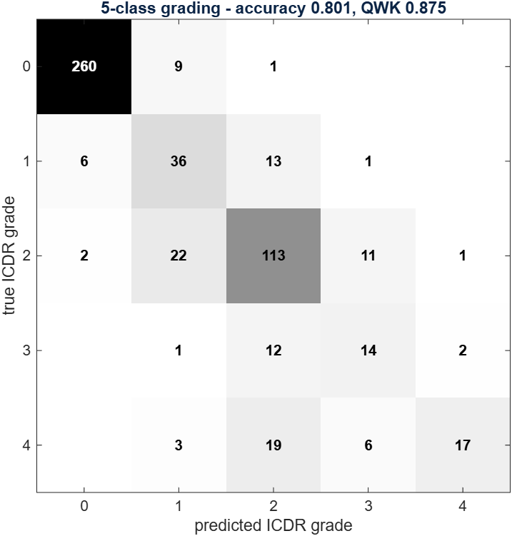
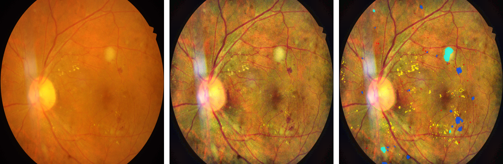
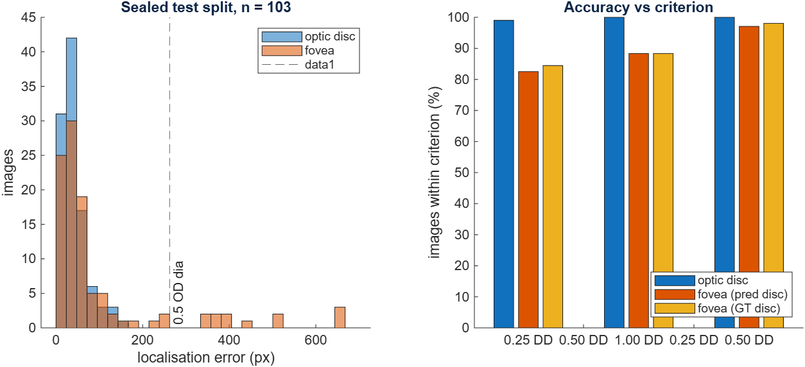
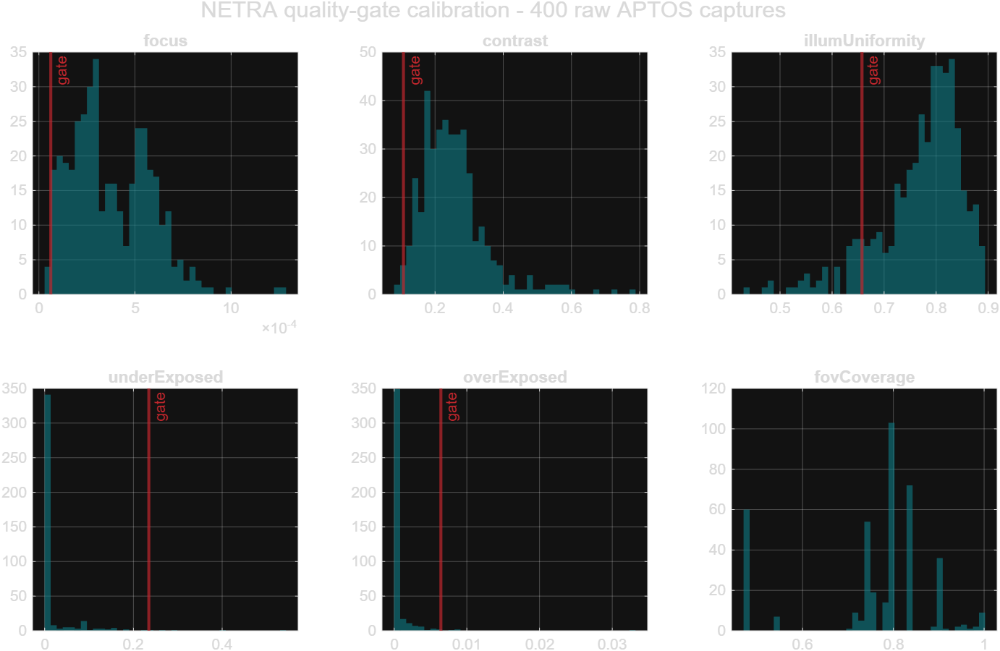
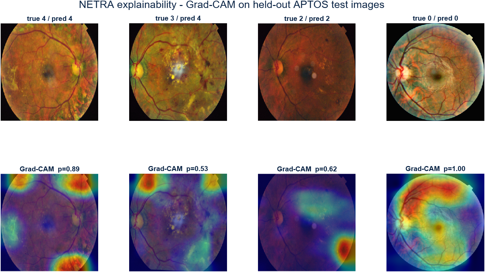
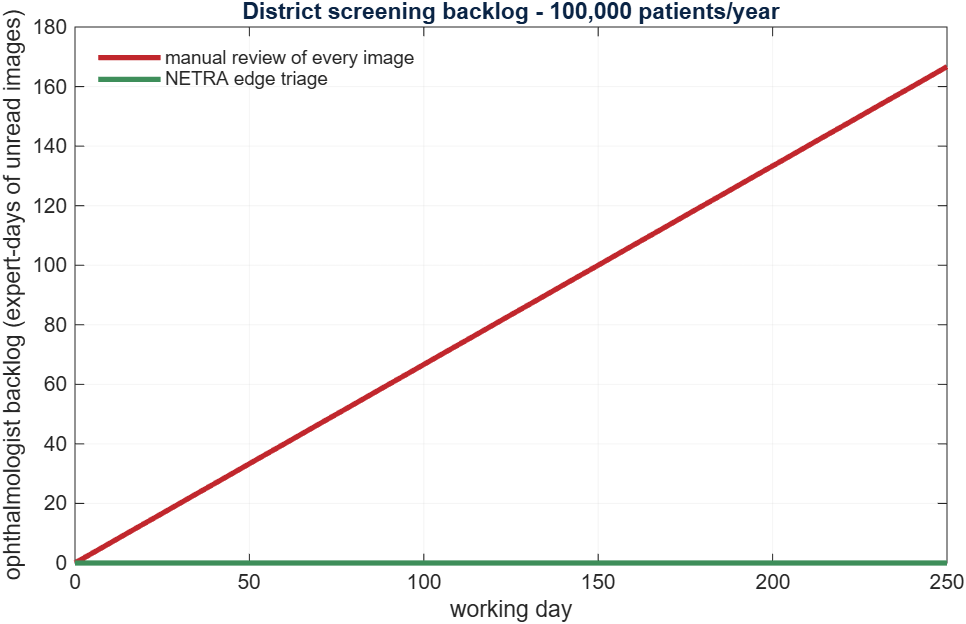

<p align="center">
  
</p>

<h1 align="center">NETRA</h1>
<p align="center"><strong>Neural Explainable Triage for Retinal Assessment</strong></p>

<p align="center">
  SIH 2026 · Problem Statement <strong>26038</strong> · MathWorks<br>
  <em>Explainable AI for Diabetic Retinopathy Screening in Rural India</em>
</p>

<p align="center">
  
  
  
  
  
</p>

---

## What this is

India has ~101 million adults with diabetes (ICMR-INDIAB, *Lancet Diab Endo* 2023) and a DR
prevalence of **16.9%**. Around **90%** of the resulting blindness is preventable if the disease
is caught early (NPCBVI / WHO). The obstacle is not medicine — it is that rural India has roughly
one ophthalmologist per 100,000 people, so a human cannot look at every retina.

NETRA is an evidence-based DR triage system that shows its work and **abstains when it cannot
see**. It is deliberately *not* "a CNN that classifies fundus images." It is a quality gate, two
independent graders that must agree with each other, and a deployment model that says out loud
when the whole arrangement stops being affordable.

Everything reported below is a measured number, written by a script in `matlab/` into
[`results/deck_facts.txt`](results/deck_facts.txt). Nothing in this README is estimated. If a
figure is not in that file, it was not measured, and it does not appear here.

---

## Quickstart

```matlab
cd matlab

netra                          % the GUI — this is the demo
netra('path\to\fundus.jpg')    % or screen one image straight from the prompt

R = netraScreen('path\to\fundus.jpg', struct('verbose',true));
R.quality.decision             % PASS | ENHANCE | REJECT
R.quality.instruction          % what the operator should do about a REJECT
R.ruleGrade.grade              % ICDR grade derived from counted lesions
R.cnnGrade.grade               % ICDR grade from ResNet-18
R.dual.decision                % AUTO_REPORT | ESCALATE
R.localisation.odCentre        % optic disc centre [x y]
R.localisation.foveaCentre     % fovea centre [x y]
R.reportLine                   % the single line a clinician reads
```

No retraining is needed to run any of this — the trained weights are committed in
[`models/`](models/). Mean end-to-end time is **6.76 s/image**, measured over 27 images in `s14`.

---

## Results

### Referable DR (ICDR ≥ 2) — sealed APTOS test split, n = 549

| | value | PS requirement |
|---|---|---|
| **Sensitivity** | **0.9193** | > 0.90 ✅ |
| **Specificity** | **0.9540** | > 0.85 ✅ |
| ROC-AUC | 0.9834 | — |
| Precision | 0.9318 | — |
| Accuracy (referable) | 0.9399 | — |

The operating point (threshold **0.478**) was chosen **on the validation split** at sensitivity
≥ 0.90 — validation reads 0.9013 / 0.9509 — and then applied *unchanged* to the sealed test
split. Choosing it on test would report the best number the test set is capable of giving, which
is not a held-out result. That distinction is the whole point.

5-class ICDR grading: **accuracy 0.8015**, **QWK 0.8755**.

Split: 2,564 train / 549 validation / 549 sealed test, stratified, `rng(42)`. Test class counts
`[270 56 149 29 45]`; 223 of 549 (40.6%) are referable.

<p align="center">
  
  
</p>

### Lesion segmentation — 27 sealed IDRiD test images

| lesion | Dice | IoU | Precision | Recall | AUPR |
|---|---|---|---|---|---|
| Hard exudate | **0.7315** | 0.5767 | 0.7444 | 0.7190 | 0.5948 |
| Haemorrhage | 0.5904 | 0.4189 | 0.6210 | 0.5627 | 0.4697 |
| Soft exudate | 0.5460 | 0.3755 | 0.7126 | 0.4425 | 0.3330 |
| Microaneurysm | 0.5185 | 0.3500 | 0.4828 | 0.5600 | 0.1990 |

Haemorrhage flag at 512px region level: accuracy 0.8061, **sensitivity 0.8505**, specificity
0.7776, ROC-AUC 0.8762. Optic disc (auxiliary, never a headline metric): Dice 0.8987, AUPR 0.5088.

<p align="center">
  
</p>

### Optic disc / fovea localisation — 103 sealed IDRiD test images

The PS asks for "optic disc/fovea localisation" as one requirement, so both halves get a
localisation error, not a segmentation score standing in for one.

| structure | mean | median | ≤ 0.25 DD | ≤ 0.5 DD | ≤ 1 DD |
|---|---|---|---|---|---|
| **Optic disc** | 42.0 px | **34.0 px** (0.065 DD) | 99.0% | **100.0%** | 100.0% |
| **Fovea** | 100.0 px | **44.5 px** (0.085 DD) | 82.5% | **88.3%** | 97.1% |
| Fovea, given the GT disc | 91.9 px | 43.4 px (0.083 DD) | 84.5% | 88.3% | 98.1% |

**DD = optic-disc diameters**, against a reference of **524.6 px** — the median of the 54
ground-truth disc masks in the segmentation training split. Measured, not assumed. 0.5 DD (one
optic-disc radius) is the criterion this task is usually quoted against.

The disc reuses the segmentation net's existing channel 5, so it costs one centroid and no second
model. The fovea has no mask to segment — IDRiD marks it with a single coordinate — so it is an
anatomical prior: the darkest broad patch of retina at a fitted offset from the disc. That offset
was **measured on the training split at 2.479 DD**, which is the textbook 2.5 arrived at from the
data rather than copied into it. Laterality needs no classifier, because the disc is nasal in both
eyes and the fovea is always on the side facing the field centre — a rule that **agreed with
ground truth on 200/200** training images. Neither detector used its fallback path on any of the
103 test images.

**Read the third row against the second.** They are almost identical (88.3% at 0.5 DD either way),
which says the disc detector is *not* the bottleneck: the ~12% of images outside 0.5 DD are the
fovea method's own failures, not error inherited from the disc. The gap between the fovea's mean
(100.0 px) and its median (44.5 px) is the same story — a small tail of hard failures, worst case
658 px, dragging an otherwise tight distribution.

<p align="center">
  
</p>

---

## The three things that are not "a CNN that classifies fundus images"

### D1 — it refuses to guess

`matlab/m1_quality/` scores focus, illumination uniformity, exposure and contrast **inside the
retinal mask** — not over the black surround, which would flatter every metric — and returns
PASS / ENHANCE / REJECT together with a specific recapture instruction: *"image is too dark —
increase flash intensity and recapture."*

The thresholds are **fitted, not chosen**. `s13_calibrate_quality` measures **400 raw APTOS
captures** and solves for a single shared percentile such that the *overall* reject rate hits a
target. This matters more than it sounds: setting each of the four reject criteria at its own
5th percentile rejects the **union**, which measured **16%** — a gate four times more expensive
than intended. At a shared p = **1.1447** the union lands at **4.75%** against a 5% target
(88.2% pass / 7.0% enhance). On IDRiD: 25 pass, 2 enhance, 0 reject, mean score 92.7.

`netraScreen` **short-circuits** on REJECT and leaves every downstream field empty, so no caller
can read a grade that was never computed.

<p align="center">
  
</p>

### D2 — dual evidence, not a decorative heatmap

A Grad-CAM map is a picture a clinician cannot falsify — it says where the network looked, not
whether it was right. Two independent estimators that must agree *is* a safety mechanism.

`m4_grade/ruleGradeICDR.m` derives an ICDR grade from **counted lesions**, including the
haemorrhage arm of the **4-2-1 rule**, quadrant-wise about the retinal centroid.
`m4_grade/dualEvidence.m` compares that against the CNN grade.

Escalation is deliberately **asymmetric**: disagreement about *whether the patient is referable*
always escalates, while one level of disagreement inside the same referable class is tolerated —
because the ICDR scale's own inter-grader agreement is not better than that. Fusion is
conservative: the higher grade carries.

**Measured on the sealed APTOS test split (n = 549):** of the CNN's **43** referable-status
errors, D2 escalated **36 (83.7%)**. Of the **28** referable cases the CNN alone missed, **0**
were auto-reported as normal.

<p align="center">
  
</p>

### D3 — the queue, not a percentage

`m5_simulink/districtSim.m` and `buildNetraSimulink.m` model a district programme of **100,000
patients/year**. The point is not a headline saving; it is that **manual review is an unstable
system**. At 400 arrivals/day one expert faces 36,000 s of reading against 21,600 s of clinical
capacity, so the backlog grows without bound — the Simulink model accumulates **167 expert-days**
in a single working year. NETRA's arm: 12,022 s/day of demand against the same 21,600 s of
capacity — **stable, zero backlog**.

| | manual | NETRA |
|---|---|---|
| Images an expert must read | 100,000 | **40,073** |
| Expert staffing | 1.67 FTE | **0.56 FTE** |
| Expert minutes per day | — | 200.4 |
| Bandwidth | 0.86 GB/day | **0.35 GB/day** (−59%) |
| Queue stable? | **No** | **Yes** |
| Backlog after one year | **167 expert-days** | **0** |

The assumption-light number is the **break-even flagged fraction: 72%**. It depends only on
arrival rate, reading time and clinical hours — *no model accuracy at all*. NETRA's validated
triage rate is **40.07%**, leaving **31.9 points** of headroom before the system stops paying for
itself.

<p align="center">
  
</p>

---

## How the pieces fit

```
fundus image
     │
     ▼
┌─────────────────────────┐
│ D1  quality gate        │   m1_quality/    PASS · ENHANCE · REJECT
└─────────────────────────┘        │
     │ PASS / ENHANCE              └──► REJECT: stop. recapture instruction. no grade.
     ▼
┌─────────────────────────┐
│ enhancement (display)   │   m2_enhance/    CLAHE on the retinal crop
└─────────────────────────┘
     │
     ├──────────────────────────────┬─────────────────────────────┐
     ▼                              ▼                             │
┌──────────────────┐      ┌──────────────────┐                    │
│ lesion U-Net     │      │ ResNet-18 grader │                    │
│ MA HE EX SE OD   │      │ ICDR 0–4         │                    │
└──────────────────┘      └──────────────────┘                    │
     │        │                  │ CNN grade                      │ Grad-CAM
     │        └──► landmarks: disc centroid (ch. 5) + fovea        │
     │                           │                                 │
     │ counted lesions           ▼                                 │
┌──────────────────┐      ┌──────────────────┐                    │
│ rule grade       │─────►│ D2 dual evidence │◄───────────────────┘
│ ICDR + 4-2-1     │      └──────────────────┘
└──────────────────┘               │
                                   ▼
                     AUTO_REPORT  ·  ESCALATE ──► D3 district queue (m5_simulink/)
```

---

## Repository layout

```
.
├── matlab/       all source — manifest below
├── models/       trained weights + the sealed split records
├── results/      measured metrics, run logs, deck_facts.txt
├── figures/      every figure in this README
├── ppt/          the 6-slide SIH deck (.pptx/.pdf) and its builder
├── docs/         design notes and decision log
└── data/         APTOS + IDRiD — see Data below
```

### Modules

| path | what lives there |
|---|---|
| `matlab/m1_quality/` | `assessQuality.m`, `qualityMetrics.m` — **D1**, the gate |
| `matlab/m2_enhance/` | `enhanceFundus.m` — display-only enhancement |
| `matlab/m3_lesions/` | lesion inference helpers; the net is built by `lib/buildLesionNet.m` |
| `matlab/m4_grade/` | `ruleGradeICDR.m`, `dualEvidence.m` — **D2**, the second opinion |
| `matlab/m5_simulink/` | `districtSim.m`, `buildNetraSimulink.m`, `netra_district.slx` — **D3** |
| `matlab/lib/` | shared primitives: crop, mask, CLAHE, loss, patching, ROC/PR, and the disc/fovea localisers (`localiseOD`, `localiseFovea`) |
| `matlab/app/` | `netraApp.m` — the GUI |
| `matlab/tests/` | `NetraPipelineTests`, `NetraDataTests`, `NetraModelTests` |

### Entry points

| file | does |
|---|---|
| `netra.m` | launches the GUI, or screens one image if given a path |
| `netraScreen.m` | the full pipeline on one image, returning the result struct |
| `netraDetect.m` | lesion segmentation alone |
| `verify_build.m` | 55 checks — **run this before submitting** |
| `run_tests.m` | all 58 unit tests |

---

## Reproducing from scratch

```matlab
run_all                        % lesion segmentation pipeline (stages 2–8)
s01_cache_aptos                % cache the 3,662 APTOS images at 512px
s11_train_grader               % ResNet-18 DR grader   (~10.6 min on an RTX 4060)
s12_eval_grader                % open the sealed grader test split — once
s13_calibrate_quality(400)     % fit the quality gate to 400 real captures
s17_localise                   % optic disc + fovea, sealed localisation split
s14_integration                % end-to-end run → results/deck_facts.txt
s15_deck_figures               % title hero + raw/enhanced/lesion triptych
s16_dual_evidence_aptos        % measure D2 in-domain on the sealed split
run_tests                      % 58 tests
```

| script | does |
|---|---|
| `s00_config.m` | every path, hyperparameter, and the fixed channel order (MA HE EX SE OD) |
| `s01_cache_aptos.m` | crop + CLAHE + resize the 3,662 APTOS images to 512px |
| `s02_cache_patches.m` | 3,520 train + 300 validation patches at **native resolution** |
| `s04_build_net.m` | assembles the net, asserts the wiring, runs the overfit test |
| `s05_train_seg.m` | trains with focal-Tversky (α 0.3 / β 0.7 / γ 0.75) + weighted BCE |
| `s06_tune_thresholds.m` | per-channel thresholds fitted on **validation only** |
| `s07_evaluate_test.m` | the one pass over the sealed 27 IDRiD test images |
| `s08_figures.m` | ground-truth-vs-prediction overlays (`s08_figures(inf)` for all 27) |
| `s11_train_grader.m` | ResNet-18 ICDR grader — 384px, batch 16, 10 epochs, lr 1e-4 |
| `s12_eval_grader.m` | sealed grader test split + ROC + confusion + Grad-CAM |
| `s13_calibrate_quality.m` | fits the D1 thresholds to a target reject rate |
| `s14_integration.m` | end-to-end run; writes `results/deck_facts.txt` |
| `s15_deck_figures.m` | title hero and the raw → enhanced → lesion triptych |
| `s16_dual_evidence_aptos.m` | measures D2 in-domain on the sealed APTOS split |
| `s17_localise.m` | fits the fovea prior on train, scores disc + fovea on the sealed split |
| `s18_report.m` | renders `results/NETRA_results.html` |

`ppt/build_deck.ps1` builds the 6-slide SIH deck. **It reads only `results/deck_facts.txt`** — a
fact no script measured renders as `n/a`, never as a plausible guess.

---

## Design decisions worth defending

**U-Net, not DeepLabv3+.** Microaneurysms are ~10 px wide at 4288×2848. A stride-16 output with
4× upsampling cannot recover them. The full-resolution `conv1` skip can.

**No downscaling anywhere in the lesion path.** Patches are cut at native resolution. Resizing to
512² — the obvious shortcut — destroys the smallest target class outright.

**Lesion-biased patch sampling (60/40).** Raises MA from 0.057% of image pixels to 0.222% of patch
pixels. The 40% uniform-random patches are what preserve specificity.

**Focal Tversky with β > α.** False negatives are penalised 2.3× harder than false positives.
Against a 0.057% target class, plain BCE reaches 99.94% pixel accuracy by predicting all-zero.

**Per-channel loss weights `[3.0 1.5 1.0 1.5 0.5]`.** MA is the smallest and hardest class; OD is
auxiliary and is deliberately down-weighted so it cannot dominate the gradient.

**Absent mask file = lesion absent.** IDRiD omits the `.tif` when a lesion does not occur. Reading
those as all-zero planes makes all 54 training images usable across all five channels.

**`enhanceFundus` is display-only.** The segmentation net was trained on
`applyClahe(retinalCrop(I))`. Inserting richer enhancement in front of it shifts the input
distribution away from training and degrades masks *silently* — no error, just worse results.

**Sealed test sets, twice.** Segmentation thresholds are fitted in `s06` on 10 validation images;
`s07` is the only script that opens the 27 test images. The grader's operating point is fitted on
its validation split; `s12` is the only script that opens its test split.

**`CFG.useAptosPretrain` stays `false`.** APTOS was restored and the flag *would* work, but
flipping it retrains the segmentation net — silently invalidating a test set that has already been
opened once.

**`CFG.seed = 42` everywhere.** Splits are recorded to `models/split.mat` and
`models/grader_split.mat`, and `verify_build` re-checks that the three grader splits are disjoint
rather than trusting that they are.

---

## Known limitations — state these before a judge finds them

- **Neovascularisation is not modelled.** No pixel-level annotation for it exists in IDRiD or
  APTOS. `ruleGradeICDR` sets `pdrDetectable = false`, so the system never implies "not PDR."
  FGADR, under a signed data-use agreement, is the route if it is needed.
- **Vessel segmentation is not built.** Nothing in the pipeline segments the vascular tree, and
  `data/drive/` is empty — the DRIVE vessel ground truth this project once planned to use was
  never brought in. This is the main thing standing between `ruleGradeICDR` and the remaining
  arms of the 4-2-1 rule, which need vessel calibre and IRMA analysis.
- **The fovea's failure tail is real and is the fovea method's own.** 11.7% of test images land
  outside 0.5 OD diameters, worst case 658 px. Substituting the ground-truth disc centre barely
  moves that (88.3% either way), so it is not inherited disc error — it is the darkness prior
  losing to a dark lesion cluster, a shadowed field, or a macula that is simply not the darkest
  thing in the window. A learned regressor over the 413 training points is the obvious next step
  and is not attempted here.
- **The reference optic-disc diameter is frozen at 524.6 px.** Every "within N DD" figure above is
  scaled by one constant measured on IDRiD. Every IDRiD image shares a resolution and field of
  view, so this is sound *on IDRiD* and would need re-deriving per camera before it means anything
  elsewhere. Disc-relative reporting would have to become per-image to survive that move.
- **The D2 escalation *cost* is not validated at deployment resolution.** `s16` measures 62.1%
  escalation on APTOS, but those images are cached at 512px — outside the lesion net's native
  resolution regime, where it over-calls (84% fused referable against a 41% true rate). The
  *safety* result — 83.7% of CNN errors caught, 0 silent misses — is sound; the operating cost is
  an **upper bound**. Fixing it means running the lesion arm on full-resolution APTOS originals.
  **This is the top next task.**
- **SimEvents is licensed on this machine but not installed** — there is no `toolbox/simevents`,
  `load_system('simevents')` fails, and `ver` reporting it is misleading. D3 is therefore built
  from core Simulink blocks. (The licence feature is `SimEvents`; `SimEvents_Toolbox` silently
  returns 0 and looks exactly like a missing toolbox.)
- **Image-level haemorrhage specificity is undefined on IDRiD** — all 27 test images contain
  haemorrhages, so there are no negatives. The 512px region figure is the meaningful one.
- **54 annotated training images.** Small by any standard; it is the IDRiD benchmark's own limit.
- **APTOS is disease-enriched** (40.6% referable), not a screening population. The district model's
  referral rate is therefore conservative — a real programme would flag fewer.
- **No external validation.** Single-centre-per-dataset. Domain shift across cameras is a listed
  risk, not a solved one.

---

## Tests and verification

```matlab
verify_build           % 55 checks: artifacts, split integrity, facts vs sources, deck
run_tests              % all 58 unit tests
run_tests("pipeline")  % quality gate, ICDR rules, dual evidence, district model
run_tests("data")      % data integrity + helpers — no trained model needed
run_tests("model")     % trained-model behaviour
```

`verify_build` is the one to run before submitting. It does **not** trust
`results/deck_facts.txt`: it re-opens the `.mat`/`.csv` files each number came from and compares,
so a hand-edited fact or a stale facts file is caught. It also re-derives the test metrics from the
raw saved scores, confirms the three grader splits are disjoint, and checks that the deck has
exactly 6 slides with no `n/a` left on any of them.

`NetraPipelineTests` is GPU-free and dataset-free on purpose: it tests decision *logic*, which is
where a screening system does harm when it is wrong. A grader two points off is a worse model; a
dual-evidence check that fails to escalate a referable disagreement is a missed diagnosis.

---

## Data

| dataset | used for | split |
|---|---|---|
| **APTOS 2019** (Kaggle) | ICDR grading, quality calibration | 2,564 train / 549 val / **549 sealed test** |
| **IDRiD** *A. Segmentation* | lesion segmentation | 44 train / 10 val / **27 sealed test** (official split) |
| **IDRiD** *C. Localization* | disc + fovea centres | 413 train / **103 sealed test** (official split) |

APTOS training images are committed under `data/aptos/`; the IDRiD components live under
`data/aptos/A. Segmentation/` and `data/aptos/C. Localization/`. Both datasets are used under
their respective research licences and are not redistributed here beyond what those licences
permit.

The two IDRiD components number their images independently — `IDRiD_001` in *Localization* is not
`IDRiD_01` in *Segmentation* — so comparing them by name proves nothing about overlap. Because the
disc half of `s17` runs the lesion net, that overlap had to be settled by content hash:
**0 of the 103 localisation test images** appear anywhere in the lesion net's training or test
data. Three of the 413 *training* images do; they affect only the fitted prior, never a reported
result. `verify_build` re-runs this comparison rather than taking it on trust.

---

## Requirements

MATLAB R2024b or newer, with the Image Processing, Deep Learning, Computer Vision, and Statistics
and Machine Learning toolboxes, plus Simulink. The ResNet-18 pretrained network support package is
required for `s11`. A CUDA GPU is optional — the grader trains in ~10.6 min on an RTX 4060 — and
nothing in the demo path needs one, because the weights are committed.

---

<p align="center"><em>Built for SIH 2026 · PS 26038 · MathWorks</em></p>
